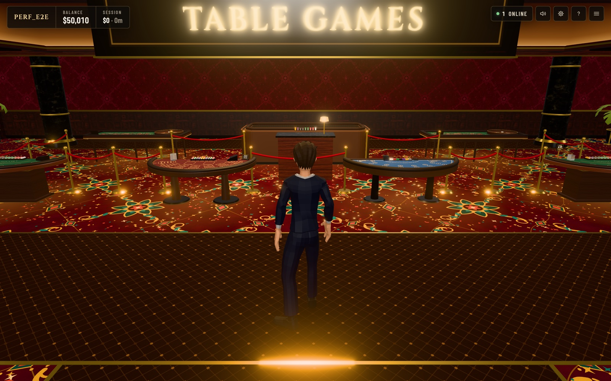

# Casino Simulator

A 3D casino you walk around in with other people, playing table games and machines that follow
Las Vegas Strip rules and pay real odds. Play it at **[j4den.com/casino](https://j4den.com/casino/)**.



Names are first come, first served: pick a password with a new name and the name is yours. The
money is play money.

## What's in it

- **The building.** A 62 × 58 m casino built in code, in fourteen rooms: a lobby with a fountain,
  the table pit under a 4.4 m coffered ceiling, a slots hall, a bar and a lounge, a poker room, a
  high limit salon, an online lounge of gaming desks, Bandit Camp (a Rust-style wheel in a scrap
  yard), the cashier and bank, a boutique, and a north wing with a Pachinko Parlour (twelve
  machines), the Jade Room (Let It Ride and Pai Gow Poker) and a Bingo Hall. You walk it with WASD
  and the mouse (N opens a map, F switches to first person), sit on any chair, stool or sofa, and
  see everyone else walking, sitting and emoting, with their name over their head. Rooms and what's
  in them are data (`client/src/world/rooms.ts`), so adding a table or a room is a data edit.
- **Outside.** The elevators in the lobby go down to the ground floor (a valet lobby, the valet
  stand and parking, the street, and across it your garage and the jail) and up to a roof terrace
  facing a city skyline at sunset. Only the server moves you between floors
  (`shared/src/zones.ts`).
- **People who work there.** A dealer at every table, bankers at the teller windows who greet you
  by name, a bartender, a shopkeeper, waiters who carry your order across the floor to you, a
  valet, four security guards on patrol and a pit boss. Seven celebrities drop in every 20 to 40
  minutes and walk a route through the rooms; talk to one for a photo and a tip ($500 to $10,000,
  once a visit).
- **Twenty-eight games.** Blackjack (a continuous shuffler), roulette (American and European),
  craps, baccarat, Three Card Poker, Let It Ride, Pai Gow Poker, Casino War, Sic Bo, the Big Six
  wheel, the Bandit Wheel, no-limit Texas Hold'em, Jacks or Better video poker, six slot machines,
  bingo and pachinko, plus twelve online-style games on the lounge's computers: Plinko, Dice, Limbo,
  Keno, Tower, Mines, Hi-Lo, Crash, Coinflip, Wheel, Cases and Diamonds. Every table game can be
  played alone or in a lobby with others (public, or private with a four-digit PIN); alone you can
  play up to five blackjack spots, or three hands at Three Card Poker, Let It Ride, Pai Gow and War.
- **Your limits.** Before you sit you pick the table's limits, from $5–$500 up to $5,000–$500,000
  or your own up to $1,000,000, and bring up to 100 times the table maximum. Every table has a
  Max bet (A). Hold'em runs at any stakes from $0.50/$1 to $100,000/$200,000 (or blinds of your
  own), 20 to 250 big blinds to sit. Alone, the other five seats are bots whose play (position
  ranges, board texture, reads) gets sharper as the stakes rise, with the odd bad play; bot tables
  rake 5% of the pot (capped at three big blinds, no flop no drop), tables of people none.
- **Tips when you want them.** Turn on the bulb and each game shows its best play as you go: the
  basic-strategy move at blackjack, the best hold at video poker, pot odds and equity at Hold'em,
  the bets with the lowest edge at the dice and wheel games.
- **Wins you can see.** A made hand, a blackjack or a big slot line gets its name on screen and
  the cards or spots that made it light up; the biggest wins drop a shower of chips on the felt,
  scroll across the LED sign over the pit, and add to the day's meter.
- **Things to spend it on.** The boutique sells chains, grills, watches, shades, hats and clothes
  from $60,000, worn on your character where everyone can see them; rides you stand on and go
  (B): a skateboard, an e-scooter, a hoverboard and a Segway; and in its vault the pieces over a
  billion (The Billionaire chain, the Emperor's Robe, the Hover Throne, the $5,000,000,000 Imperial
  Crown). Also: eight emotes (Throw It Back, the Griddy, Backflip and more, $60,000 to $500,000),
  nine room effects ($5,000 confetti to Own the Night at $1,000,000,000: your name on every sign
  and screen), a $10,000,000 gold statue of you in the lobby (the three latest buyers), and twelve
  cars from $250,000 to $2,000,000,000, bought at the valet, brought round to the curb when you
  call, and parked in your own garage across the street.
- **Food and drink.** Seventeen things on the bar's menu, brought by a waiter and had sip by sip
  and bite by bite until the glass or plate is empty. Espresso and energy drinks quicken your
  step, champagne makes you sparkle, a bottle of Dom sets you celebrating, a few drinks make you
  tipsy (a sway you can turn off), a plate leaves you well fed. None of it touches the odds.
  Happy hour: fifteen minutes of half price at the bar in every hour and three quarters.
- **Achievements and challenges** (J). 102 across all 28 games: things done (a blackjack, a royal
  flush, a point made) and amounts reached ($10,000 won up to $100,000,000), plus three daily
  challenges the same for everyone. Rewards are cash (scaled to your stake, so $1 bets can't farm
  them), pieces and emotes that are never sold, and 23 titles to wear under your name.
- **Coming back.** A daily bonus that grows with a streak, $2,500 on day one to $50,000 from day
  seven; gift boxes ($1,000 to $5,000) left in quiet corners for the first to find them.
- **The bank.** Savings pay daily interest (0.5% on the first $100,000, 0.1% up to $1,000,000,
  paid at midnight UTC); term deposits lock money for an hour, a day or a week (0.015%, 0.4%,
  3.5%); the Casino Index fund moves every five minutes, the same for everyone; a statement lists
  every movement. Send money to other players, up to $250,000 a day and $100,000 to any one; money
  from the house is held three days first and money from players one.
- **Leaderboards and stats.** Eighteen casino-wide boards (richest, up and down overall, today and
  this week, biggest win and loss, win rate, longest streak, achievements, celebrities met,
  collection value and more) and eight for each game, with your own place on each; and a stats
  page with a 14-day chart and every game's figures in a sortable table.
- **The law.** Punch someone (V) and nobody gets hurt, but a guard who sees it comes over. The pit
  boss comes over if he sees you win too much at his tables. The first time is a warning; caught
  again within five minutes, you're walked across the street to jail. You get out by winning your
  bail at the jail's blackjack and Sic Bo tables (a fiftieth of what you're worth, $1,000 to
  $25,000; losses never take you below where you started), and you keep what you won.
- **Other people.** Chat on the floor and at your table, pinned open while you walk if you like,
  speech bubbles, and six free emotes (wave, cheer, clap, thumbs up, shrug and 67). Invite chosen
  players or everyone to your table: they get a card for two minutes and join with a click (or
  Shift+J), PIN or not; do not disturb turns them off. Fifteen minutes without input and you're
  asked if you're still there, then stood up and shown the way back.
- **Money that stays put.** Accounts start with $50,000. The server holds every balance and deals
  every card; the browser only sends what you want to do. Whenever you're down to less than
  $10,000 in all (balance, table chips, the bank, and what you sent in the last three days), a
  banker tops you back up to $50,000 and the profile counts the loans.
- **Comfort.** Reduce flashing & motion (on the login screen and in Settings, on by default when
  the system asks for less motion) holds every blinking and chasing light steady, softens the
  particles and the bloom, and drops camera shake and the tipsy sway. Phones and tablets
  get a thumb stick, drag to look, and layouts that fit either way up; every game's board fits on
  a small window.

## Rules and odds

Each game's full rules, paytables, strategy charts and sources are in [docs/RULES.md](docs/RULES.md).
The Monte Carlo suite plays millions of rounds of each and requires the measured house edge to land
within three standard errors of the published one:

| Game | Bet | Published edge | Measured |
|---|---|---|---|
| Blackjack (6 decks in a continuous shuffler, S17, 3:2, DAS, late surrender) | Basic strategy | 0.334% | 0.326% (12M rounds) |
| Roulette, American | Every bet but the top line | 5.263% | 5.229% on red (3M spins) |
| Roulette, European | Every bet | 2.703% | 2.717% on red (3M spins) |
| Craps | Pass line | 1.414% | 1.426% (4M bets) |
| | Don't pass | 1.364% | 1.389% (2M bets) |
| | Field (3:1 on 12) | 2.778% | 2.712% (4M bets) |
| Baccarat | Banker | 1.058% | 1.011% (10M coups) |
| | Player | 1.235% | 1.283% (10M coups) |
| | Tie (8:1) | 14.360% | 14.300% (10M coups) |
| Three Card Poker | Ante and Play (Q-6-4) | 3.373% | 3.384% (10M hands) |
| | Pair Plus (40-30-6-3-1) | 7.276% | 7.264% (10M hands) |
| Video poker, Jacks or Better 9/6 | Optimal holds | 0.456% (99.544% RTP) | 99.447% RTP (20M hands) |
| Casino War | Going to war on every tie | 2.330% | 2.323% (10M rounds) |
| | Tie (10:1) | 18.650% | 18.642% (10M rounds) |
| Let It Ride | The three bets, pull-back strategy (per unit) | 3.506% | 3.443% (10M hands) |
| | 3-Card Bonus (50-40-30-6-3-1) | 7.095% | 7.151% (10M hands) |
| Pai Gow Poker (joker, 5% commission) | Set by the house way | 2.731% | 2.715% (10M hands) |
| | Fortune (pay table 2) | 7.766% | 7.728% (10M hands) |
| Sic Bo | Small or Big | 2.778% | 2.755% / 2.781% (4M rolls) |
| | Any triple (30:1) | 13.889% | 14.197% (4M rolls) |
| Big Six wheel | $1 (1:1) | 11.111% | 11.109% (10M spins) |
| | Star or Crown (40:1) | 24.074% | 23.921% / 24.214% (10M spins) |
| Slots: Classic Sevens / Neon Nights / 5x Wild | | 94.428% / 95.374% / 89.820% RTP | 94.563% / 95.325% / 89.968% RTP |
| Slots: Diamond Line / Lucky Cherries / Gold Rush | | 94.983% / 94.028% / 92.994% RTP | 94.929% / 94.126% / 93.138% RTP |
| Bandit Wheel | 1 / 10 / 20 | 4% / 12% / 16% | 3.965% / 12.085% / 15.946% (10M spins) |
| Plinko | 16 rows, High | 98.976% RTP (every board 98.906–99.160%) | 98.938% RTP (4M drops) |
| Dice | 49.50% to win, $1 | 99% RTP before the cent | 98.978% RTP (10M rolls) |
| Limbo | 2× target | 99% RTP (every target) | 98.974% RTP (10M bets) |
| Keno | Classic, 10 picks | 99.037% RTP | 99.057% RTP (5M draws) |
| Tower | Easy, cash out at row 3 | 98.719% RTP (Hard to Master 99% every row) | 98.705% RTP (4M climbs) |
| Mines | 3 mines, 5 gems | 98.635% RTP (no cell above 99%) | 98.683% RTP (4M boards) |
| Hi-Lo | likelier side, one guess | 98.728% RTP | 98.739% RTP (10M guesses) |
| Crash | auto cash-out at 2× | 99% RTP (every cash-out) | 98.968% RTP (10M rounds) |
| Coinflip | one call, then cash out | 99% RTP (every stop) | 98.925% RTP (10M rounds) |
| Wheel | every wheel (10 to 50 segments, Low to High) | 99% RTP | all 15 within 1.6 SE (2M spins each) |
| Cases | Starter, Classic, High Roller, Vault | 99% RTP | 98.984% / 99.250% / 99.204% / 99.496% RTP (5M each) |
| Diamonds | every hand | 99% RTP | 99.127% RTP (10M hands) |
| Bingo | every card (line, four corners, blackout) | 96.710% RTP | 96.953% RTP (3M cards) |
| Pachinko | every batch of 25 balls | 96.692% RTP | 96.572% RTP (2M batches) |
| Texas Hold'em | | no house edge; bot tables rake 5% (cap 3 big blinds) | 0 per seat within 1.2 SE (300K hands, 6 seats) |

Where the outcome space is small enough the engines are also enumerated exactly (every roulette
spot, every craps bet, every Sic Bo roll and Big Six stop, all 4,998,398,275,503,360 baccarat
six-card sequences, all 407,170,400 Three Card Poker deals, all 2,598,960 Let It Ride hands, all
154,143,080 Pai Gow Fortune hands, every video poker deal and draw, every slot reel stop, every
bingo and pachinko draw, all 16,807 Diamonds hands and every segment of every Wheel), and the
strategy tables are tested cell by cell. Cards and numbers come from `crypto.getRandomValues` with
rejection sampling, and shoes are shuffled with Fisher-Yates.

## How it works

```
browser (Three.js + DOM)  --HTTPS-->  Worker: login, profile, bank, lobby create/join
                          <--WS---->  CasinoFloor Durable Object: presence, online count, lobby list
                          <--WS---->  CasinoTable Durable Object: one per table, runs the game
                                         |
                                         v
                                      D1: accounts, balances, a ledger, loans, stats,
                                          the bank, feats and tallies, jail stays
```

- The rules of every game are pure TypeScript in `shared/src/games/`, with no browser or Workers
  APIs. The server runs them, the tests run them millions of times, and the client only imports
  their types to know what to draw.
- Buying in moves money from your D1 balance onto the table (an escrow row, in one transaction).
  Rounds settle inside the table's Durable Object, and cashing out moves the stack back. Every
  transfer has an idempotent operation id, so a retry after a dropped connection can't pay twice.
- Views animate to results the server already decided: the wheel is solved backwards from the
  pocket, the dice land on the faces that were rolled, the reels stop where the server stopped
  them.
- A dropped player keeps their seat for two minutes; turns that time out stand or fold for them.
- The floor object also runs the elevators, the guards and the pit boss, the celebrities' visits,
  invites and the valet. Tables tell it when someone wins too much; it decides who saw.

More in [docs/ARCHITECTURE.md](docs/ARCHITECTURE.md) and the wire format in
[docs/PROTOCOL.md](docs/PROTOCOL.md).

## Stack

TypeScript throughout, no frameworks. [three.js](https://threejs.org/) for the 3D, Vite to
bundle, Cloudflare Workers with SQLite-backed Durable Objects and D1 on the server, and Vitest
(with the Workers pool for the server tests). Everything is bundled; the page loads no scripts
from other sites.

## Running it locally

Node 22.12 or newer.

```sh
npm ci
npm run dev                 # http://localhost:5173/casino/  (Vite on 5173, the Worker on 5174)
```

`npm run dev` applies the D1 migrations to a local database and runs `wrangler dev` next to Vite.
Open a second browser (or a private window) to be a second player; each tab keeps its own login.

```sh
npm test                    # unit and Worker tests
npm run test:mc             # the Monte Carlo suite (a few minutes)
npm run typecheck
npm run build               # the client to dist/casino, the Worker to dist/worker
```

`?dev=table&game=<game>` opens one game's table on its own, and `?dev=floor` the floor. The dev
pages and the headless scripts in `scripts/e2e/` log in with the password `casino-dev`
(`DEV_PASSWORD` in `client/src/net/api.ts`), so the names they use stay theirs locally.

## Credits

The cards, fonts, sounds, character models, props and textures are CC0 or SIL OFL; every one is
listed with its source in [docs/CREDITS.md](docs/CREDITS.md). Everything else (the tables, the
wheel, the slot and pachinko machines, the felts, the carpet, the boutique's pieces, the cars, the
street and the skyline) is drawn in code here, and the rest of the sounds are synthesized.

Code is MIT licensed; see [LICENSE](LICENSE).
